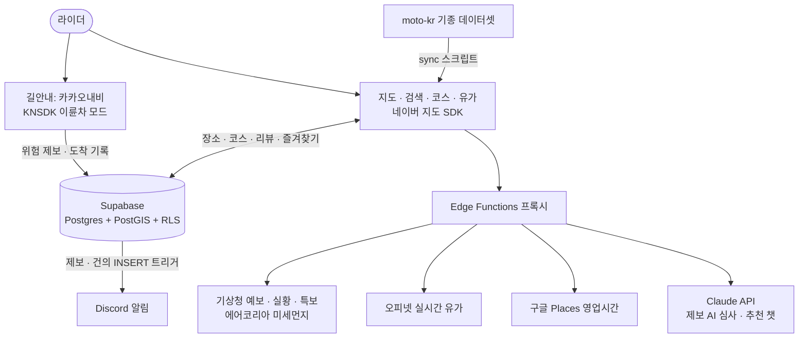

# 🏍️ 모토맵

> 오토바이 라이더를 위한 지도 앱

[](https://apps.apple.com/app/id6773636183)


라이딩 갈 만한 카페, 맛집, 뷰포인트부터 주유소와 정비소 등을 지도에서 찾고, 이륜차 전용 길안내로 바로 떠나고, 리뷰와 코스로 라이더끼리 정보를 나누는 앱입니다. 출발 전에는 기상청 예보 기반 라이딩 날씨로 비 소식을 확인할 수 있고, App Store에서 다운로드할 수 있습니다.

<p align="center">
  
  
</p>

## 📱 스크린샷

| 지도 | 경로 미리보기 | 길안내 |
|:---:|:---:|:---:|
|  |  |  |
| **음성 검색** | **코스 탐색** | **실시간 유가** |
|  |  |  |

## ✨ 주요 기능

- 🧭 **길안내**: 카카오내비 SDK 이륜차 모드 턴바이턴. 미리보기에서 추천·시간·거리·큰길 4개 옵션의 경로를 교통 혼잡도 색으로 비교하고, 출발지·경유지(최대 3개, 드래그 정렬·지도에 순번 마커)·도착지를 그 자리에서 바꿔가며 고릅니다. 출발 전에는 경로의 비 소식과 노면 위험 제보를 경고합니다
- 🗺️ **지도 + POI**: 네이버지도 기반 바이커 장소 탐색 (카페, 맛집, 휴게소, 주유소, 정비소, 뷰포인트, 용품점, 캠핑, 세차). 별 토글을 켜면 즐겨찾기가 이름과 함께 별 마커로 항상 표시됩니다
- 📍 **일반 장소**: 지도의 가게 아이콘이나 이름을 탭하면 등록되지 않은 곳도 바로 카드가 뜨고 길안내와 제보로 이어집니다
- 🔎 **통합 검색**: 등록 장소와 코스에 더해 일반 장소까지 검색하고, 엔터를 누르면 결과 전체를 지도 + 목록으로 봅니다. 띄어쓰기가 달라도 찾아주고, 집과 회사를 저장해두면 원터치로 길안내합니다
- 🎙️ **음성 검색**: 지도 검색바·검색 화면·길찾기 어디서든 마이크를 눌러 말하면 됩니다. 장갑을 낀 채 정차 중에 쓰라고 만든 기능입니다
- 🌦️ **라이딩 날씨**: 기상청 단기예보 기반 라이딩 점수와 시간대별 강수확률, 미세먼지, 발효 중인 기상특보(폭염·호우 등 + 라이딩 유의사항)를 제공합니다. 길안내 전에 경로의 비 소식도 경고합니다
- ⛽ **실시간 유가**: 오피넷 연동으로 주변 주유소 가격과 최저가를 표시합니다
- 🙋 **장소·위험 제보**: 크라우드소싱으로 장소와 노면 위험(포트홀 등)을 제보합니다. (주소 검색, 사진 포함) AI가 먼저 심사하고 승인과 반려 사유, 건의 답변까지 내 제보 목록에서 추적합니다
- ⭐ **리뷰와 평점**: 사진 스와이프, 수정과 삭제, 리뷰어 바이크 뱃지
- 🛣️ **라이딩 코스**: 추천 코스 목록, 지금이 제철 뱃지, 코스 전체 길안내
- 🤖 **AI 추천**: 대화로 라이딩 코스나 장소를 추천해주는 챗봇
- 🏍️ **내 바이크**: 기종 검색 자동완성 1,040종 ([moto-kr](https://github.com/starhn87/moto-kr) 오픈소스 API). 등록하면 제원 도감 카드, 주유소에서 내 유종 강조와 가득 주유비, 리뷰 기종 뱃지, AI 추천 반영, 라이딩 기록(다녀온 곳·횟수)까지 이어집니다
- 🛡️ **커뮤니티**: 신고와 차단, 회원 탈퇴

## 🧰 기술 스택

| 영역 | 사용 |
| --- | --- |
| 앱 | React Native 0.81 / Expo SDK 54 / TypeScript |
| 라우팅 | expo-router (typed routes) |
| 지도 | @mj-studio/react-native-naver-map (+ 심벌 탭 패치, patch-package) |
| 길안내 | 카카오내비 SDK(KNSDK) 이륜차 모드: 네이티브 모듈 직접 브리징 (`modules/kakao-navi/`) |
| 교통 혼잡도 | 카카오모빌리티 길찾기 REST (미리보기 경로선 색칠) |
| 위치 | expo-location (현재 위치 표시) |
| 검색과 지오코딩 | 카카오 로컬 API |
| 날씨 | 기상청 단기예보 + 에어코리아 미세먼지 (Supabase Edge Function 프록시) |
| 유가 | 오피넷 API (Supabase Edge Function 프록시) |
| AI | Anthropic Claude (제보 심사와 추천 챗) |
| 기종 데이터 | [moto-kr](https://github.com/starhn87/moto-kr) (KENCIS 인증 기반 오픈소스 API) |
| 푸시 | expo-notifications + Expo Push (승인, 반려, 답변 알림) |
| 백엔드 | Supabase (Postgres + PostGIS + RLS + Edge Functions) |
| 상태와 데이터 | Zustand, @tanstack/react-query |
| 소셜 | @react-native-kakao/core |
| 모니터링 | Sentry (크래시·성능) |
| 제품 분석 | PostHog (이벤트·퍼널·세션 리플레이, EU 리전) |
| 배포 | EAS Build + Submit, expo-updates OTA |

## 🏗️ 아키텍처



> 🧭 **코드 레벨 아키텍처**(레이어, 데이터 흐름, 상태, DB 스키마)는 [docs/ARCHITECTURE.md](docs/ARCHITECTURE.md) 참조.

## 📂 프로젝트 구조

```
app/                  expo-router 파일 기반 라우팅
  (tabs)/             탭 (index 지도, courses 탐색, submit 제보, profile 내 정보)
  navi.tsx            경로 미리보기: 옵션 비교, 교통색, 경유지 편집 → 길안내 시작
  directions.tsx      길찾기 (출발지·경유지·도착지)
  search.tsx          통합 검색 (장소, 코스, 일반 장소, 내 장소)
  search-results.tsx  검색 결과 지도 (마커 + 목록)
  my-submissions.tsx  내 제보 목록 (장소·코스·건의, 반려 사유와 답변)
  course/[id].tsx     코스 상세
  chat.tsx            AI 추천 챗
  notifications.tsx   알림 목록
  legal/[type].tsx    약관과 정책 뷰어
components/           재사용 UI (map, review, submit, auth, ...)
modules/
  kakao-navi/         카카오내비 SDK 네이티브 모듈 (iOS 브리지, 이륜차 안내 화면)
lib/                  Supabase 클라이언트, API 래퍼, 유틸
  api/                places, courses, reviews, weather, gasStations, kakaoLocal, ...
hooks/                React Query 훅 (usePlaces, useCourses, useNotifications, ...)
stores/               Zustand (auth, chat, map, myPlaces)
patches/              네이버맵 심벌 탭 네이티브 패치 (postinstall 자동 적용)
supabase/
  migrations/         스키마 마이그레이션 (SQL Editor에서 번호 순서대로 실행)
  functions/          Edge Functions (judge-submission, weather-kr, air-kr, gas-stations, moto-chat, ...)
```

## 🚀 개발 환경 설정

```bash
# 1. 의존성 설치 (postinstall이 patches/ 를 자동 적용)
npm install

# 2. 환경 변수
cp .env.example .env
# .env 에 Supabase / 네이버 / 카카오 키 입력

# 3. Supabase 마이그레이션 실행
# Supabase 대시보드 > SQL Editor 에서 supabase/migrations/*.sql 을 번호 순서대로 실행

# 4. 개발 빌드 실행 (네이티브 모듈이 있어 Expo Go 불가, dev client 필요)
npm run ios
npm run android
```

> ⚠️ 네이버 지도와 카카오 등 네이티브 모듈을 사용하므로 **Expo Go로는 실행되지 않습니다.** `npm run ios`/`android`(로컬 dev client) 또는 EAS development 빌드를 사용하세요.

## 🔑 환경 변수

| 변수 | 설명 |
| --- | --- |
| `EXPO_PUBLIC_SUPABASE_URL` | Supabase 프로젝트 URL |
| `EXPO_PUBLIC_SUPABASE_ANON_KEY` | Supabase anon 키 |
| `NAVER_MAP_CLIENT_ID` | 네이버지도 SDK 클라이언트 ID |
| `EXPO_PUBLIC_NAVER_CLIENT_ID` | 네이버 클라우드 API 클라이언트 ID (지오코딩, 스크립트의 경로 재계산) |
| `EXPO_PUBLIC_NAVER_CLIENT_SECRET` | 네이버 클라우드 API 시크릿 |
| `KAKAO_NATIVE_APP_KEY` | 카카오 네이티브 앱 키 (KNSDK 길안내 인증) |
| `EXPO_PUBLIC_KAKAO_REST_API_KEY` | 카카오 로컬 REST 키 (장소 검색과 지오코딩) |
| `EXPO_PUBLIC_SENTRY_DSN` | Sentry DSN (선택) |
| `EXPO_PUBLIC_POSTHOG_API_KEY` | PostHog 프로젝트 키 (선택: 없으면 계측 전체가 무효화된다) |
| `EXPO_PUBLIC_POSTHOG_HOST` | PostHog 호스트 (기본 `https://us.i.posthog.com`) |
| `SUPABASE_SERVICE_ROLE_KEY` | 시드 스크립트 전용 (선택) |

> 로컬 EAS 명령(`eas build`/`submit`)은 `.env`를 자동 로드하지 않으므로, 클라우드 빌드용 키는 EAS 환경 변수에 등록되어 있습니다 (`eas env:list --environment production`). 날씨와 유가, AI 키는 앱이 아닌 Supabase Edge Function secrets에 있습니다.

## 📦 빌드 & 배포 (EAS)

```bash
# 최초 1회
npx eas login

# 빌드
npx eas build --profile development --platform ios     # dev client (실기기 디버깅)
npx eas build --profile production  --platform ios     # 스토어 / TestFlight 제출용

# 스토어 제출 (App Store Connect API Key 사용 → 보안 지연 없이 비인터랙티브)
npx eas submit --profile production --platform ios --latest

# JS만 바뀐 업데이트는 OTA로 배포
npx eas update --channel production --platform ios --message "..."
```

> ⚠️ 이미 App Store에 출시된 버전 위에 새 빌드를 올릴 때는 **`app.config.js`의 `version`을 반드시 기존보다 올려야** 합니다 (동일 버전은 `ITMS-90186` train closed 로 거부). 빌드 번호는 production 프로파일의 `autoIncrement`가 처리합니다.
